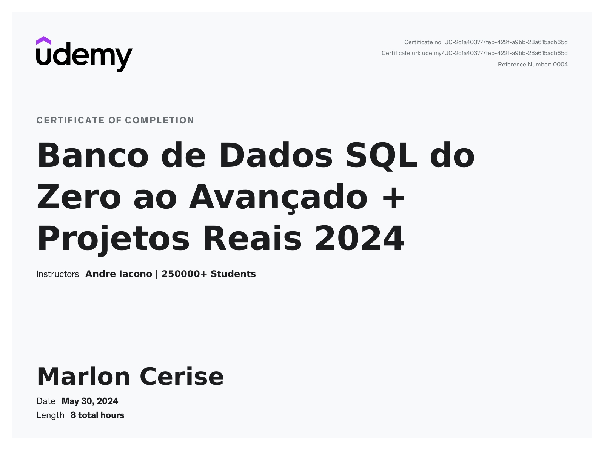

# Curso Aprenda SQL - MySQL Do Básico ao Avançado com Projetos Inclusos na Udemy - Conclusão

## Objetivos do Curso

Este curso abrangente na Udemy proporcionou uma sólida compreensão do SQL, desde os conceitos básicos até técnicas avançadas, juntamente com projetos práticos. Ao concluir o curso, adquiri as seguintes habilidades:

- Utilização avançada de SQL para consultas em bancos de dados.
- Capacidade de criar e gerenciar bancos de dados do zero.
- Domínio na escrita de consultas complexas envolvendo várias tabelas.
- Aplicação prática na modelagem de dados do mundo real e na geração de relatórios significativos.

## Certificados de Conclusão

Ao concluir este curso com sucesso, obtive meus certificados de conclusão. Você pode visualizá-los nos formatos PDF e PNG nos links abaixo:

- [Certificado em PDF](./UC-2c1a4037-7feb-422f-a9bb-28a615adb65d.pdf)

---

Este README.md destaca as habilidades valiosas que adquiri durante o curso Aprenda SQL - MySQL Do Básico ao Avançado com Projetos Inclusos na Udemy. Se você deseja mais detalhes sobre o conteúdo específico do curso ou como acessar seus certificados, sinta-se à vontade para entrar em contato.
